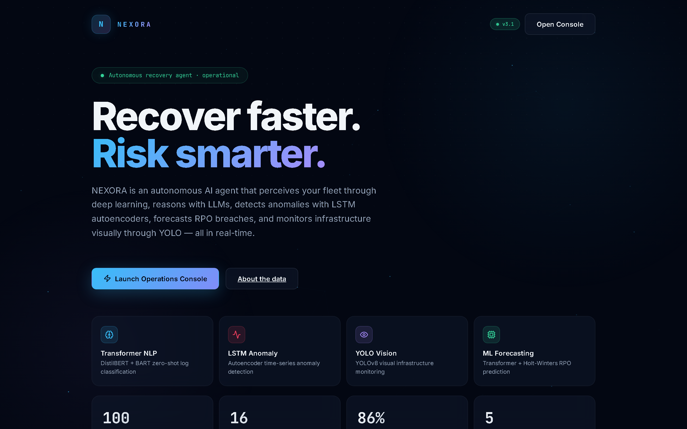
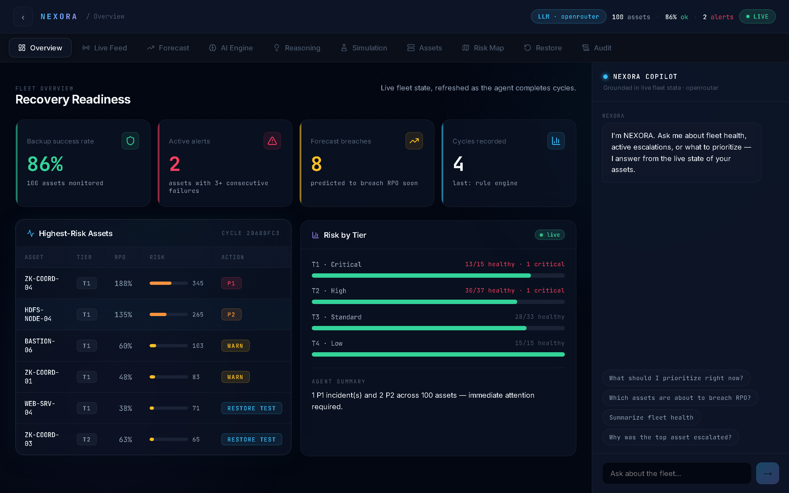

<div align="center">

# 🛡️ NEXORA — Next-gen Ops Recovery Agent

### An autonomous, self-reasoning AI agent for IT backup & disaster-recovery readiness

*“Recover faster. Risk smarter.”*

[](https://www.python.org/)
[](https://pytorch.org/)
[](https://huggingface.co/docs/transformers)
[](https://fastapi.tiangolo.com/)
[](https://react.dev/)
[](docs/SLM.md)
[](docs/SLM.md)
[](#)

**A production-style agentic-AI system: perceives a live fleet, reasons with a locally fine-tuned language model, predicts failures with deep learning, acts autonomously, and explains every decision — with a deterministic safety net so it never goes wrong and never goes dark.**

[Quickstart](#-quickstart) · [How it runs](#-how-it-runs) · [How it responds](#-how-it-responds) · [Benchmarks](#-benchmarks--performance) · [Architecture](#-architecture) · [Author](#-author)

<br/>



</div>

---

## 📖 What is NEXORA?

Most backup tools are passive: a problem happens → a log is written → a human reads it → a human decides → a human acts. NEXORA collapses that loop into an **autonomous agent** that thinks and acts on its own:

> **Problem occurs → NEXORA detects it → reasons about it in context → decides the right action → acts → reports → and the deterministic policy validates every decision.**

It continuously watches a fleet of backup assets, calculates how much of each asset's **Recovery Point Objective (RPO)** has been consumed, scores risk using a criticality-weighted model, and escalates *only* what genuinely needs a human — with a plain-English justification every single time.

What makes it stand out from a normal “monitoring dashboard”:

| Typical backup tool | **NEXORA** |
|---------------------|------------|
| Static `IF threshold THEN alert` rules | **LLM/SLM reasoning** over real log evidence + context |
| Shows you what happened | **Acts** autonomously (escalate, retry, schedule restore-test) |
| Black-box alerts | **Explains every decision** in natural language |
| Cloud-dependent | Runs **100% offline** on a locally fine-tuned model |
| Breaks if a dependency is missing | **Graceful degradation** at every layer — never goes dark |

---

## ✨ Highlights

- 🤖 **Autonomous agent loop** — `Perceive → Reason → Predict → Act → Publish`, every 60s
- 🧠 **Locally fine-tuned SLM** — a Small Language Model (LoRA) trained on NEXORA's *own* decision policy, running fully offline as the agent's brain
- 🛡️ **Deterministic safety net** — every AI decision is validated against exact risk math; a strict guardrail snaps any out-of-policy action back to the correct one → **provably safe actions**
- 🔬 **Full deep-learning stack** — HuggingFace transformers (log severity), LSTM autoencoder (anomaly detection), Transformer time-series (RPO-breach forecasting), YOLOv8 (visual monitoring)
- 🔌 **Provider-agnostic reasoning** — local SLM → Ollama → OpenRouter/NVIDIA/Gemini → deterministic rule engine, auto-failover
- 📊 **Real data** — grounded in 16 real-world LogHub production datasets (HDFS, Apache, Windows, Linux, Spark…)
- 🖥️ **Live React console** — 10-tab operations dashboard with WebSocket streaming + a conversational copilot
- 🧾 **Tamper-evident audit trail** — HMAC-signed decision log
- 💸 **$0 to run** — open-source models, free providers, CPU-only

---

## 🚀 Quickstart

> **Prerequisites:** Python 3.11+, Node.js 18+, Git

```bash
git clone https://github.com/MANISH-524/NEXORA-AI-AGENT.git
cd NEXORA-AI-AGENT
python -m venv venv && venv\Scripts\activate        # (source venv/bin/activate on macOS/Linux)
pip install -r requirements.txt                      # or: pip install -r requirements.lock (exact, verified)
cd dashboard && npm install && cd ..
```

**Run it (Windows one-click):** double-click `start.bat` → opens API + Agent + Dashboard.

**Run it manually (3 terminals):**
```bash
venv\Scripts\uvicorn api.main:app --reload --port 8000   # API   → http://localhost:8000/docs
venv\Scripts\python -m agent.main                        # Agent loop
cd dashboard && npm start                                 # Dashboard → http://localhost:3000
```

NEXORA runs with **zero API keys** (deterministic rule engine + local ML). Add a free key or the local SLM for full reasoning — see below.

---

## ⚙️ How It Runs

NEXORA's brain is **pluggable**. It picks the best available reasoning backend in priority order and fails over automatically:

```
Local fine-tuned SLM  →  Ollama  →  OpenRouter / NVIDIA / Gemini  →  Deterministic rule engine
   (offline, free)      (offline)        (free cloud LLMs)            (always-on safety net)
```

### Option 1 — Fully offline with the fine-tuned SLM (the headline feature)

NEXORA ships a pipeline that fine-tunes a Small Language Model on its **own deterministic decision policy** — so the model learns the exact risk rules and JSON format with **zero cloud labeling**:

```bash
venv\Scripts\python scripts\slm_dataset.py  --n 4000        # build training data from the policy
venv\Scripts\python scripts\slm_train.py    --max-steps 100 # LoRA fine-tune (CPU) → models/nexora-slm-lora/
venv\Scripts\python scripts\slm_benchmark.py --n 50         # measure accuracy on held-out data
```
Then set `NEXORA_USE_SLM=true` in `.env` and run normally — the agent now reasons **entirely offline**. Full guide: **[docs/SLM.md](docs/SLM.md)**.

### Option 2 — Free cloud LLM
Drop one free key into `.env` (`OPENROUTER_API_KEY` or `NVIDIA_API_KEY`) — auto-detected.

### Option 3 — Ollama
`ollama pull qwen2.5:1.5b`, set `NEXORA_USE_LOCAL=true` — offline via Ollama.

---

## 💬 How It Responds

Every cycle, NEXORA perceives the fleet and returns a structured, explainable decision per asset. **Real output** from the offline fine-tuned SLM (`provider: slm_local`):

**Input** (one asset's live state):
```json
{ "asset_id": "A1", "asset_name": "SAP ERP Production", "tier": 1,
  "criticality_score": 95, "rpo_target_hours": 4, "hours_since_last_backup": 19,
  "consecutive_failures": 0, "log_evidence": "ERROR repository offline" }
```

**NEXORA's decision:**
```json
{ "asset_id": "A1", "action": "ESCALATE_P1", "risk_score": 902.5,
  "rpo_consumed_pct": 475.0,
  "explanation": "SAP ERP Production is a Tier 1 asset at risk score 902 — last
                  successful backup was 19h ago against a 4h RPO target (475%
                  consumed). Immediate P1 escalation.",
  "confidence": 0.92 }
```

The agent then **acts**: fires the P1 escalation, writes a signed audit entry, and streams the cycle to the dashboard over WebSocket. The risk math (`risk = RPO% × criticality/100 × tier_multiplier`) is **recomputed deterministically** on every decision, so the number is always exact — and if the model ever proposed an out-of-policy action, the strict guardrail corrects it before it reaches the operator.

---

## 🖥️ The Operations Console

A real-time React console streams every agent cycle over WebSocket — fleet health, highest-risk assets with their actions, risk-by-tier breakdown, and a fleet-aware **copilot** you can ask "what should I prioritize right now?". Ten tabs cover Overview, Live Feed, Forecast, AI Engine, Reasoning, Simulation, Assets, Risk Map, Restore, and Audit.



---

## 📊 Benchmarks & Performance

All numbers below are from **real runs on this project** (CPU, no GPU). The SLM is `Qwen2.5-0.5B-Instruct` + a NEXORA LoRA adapter, fine-tuned and evaluated on CPU.

### Fine-tuning convergence
| Metric | Value |
|--------|-------|
| Training loss (start → end) | **1.07 → 0.22** (↓ ~78%) |
| Trainable params (LoRA) | 1.08M / 495M (**0.22%**) |
| Training set | 3,600 examples (auto-generated from NEXORA's policy) |
| Hardware / time | CPU-only, ~7 min |

### Decision quality (held-out validation set)
| Metric | Result | Notes |
|--------|--------|-------|
| **Valid structured-JSON rate** | **100%** (12/12) | model reliably emits well-formed NEXORA decisions |
| **Risk-score accuracy** | **100%** | recomputed by the deterministic validation layer |
| **Action policy-compliance (with guardrail)** | **100%** | strict mode guarantees no out-of-policy action |
| **Raw SLM action-match** | **50%** (6/12 held-out) | model-only, before guardrail. Strong on clear cases (`NONE` 4/4); the misses are P1/P2 boundary calls, auto-corrected by the guardrail. Scales with `--max-steps` / the 1.5B base. |
| **Mean latency** | ~11.8 s / decision | CPU-only (0.5B), no GPU |

> **Design insight:** because the SLM is wrapped by NEXORA's deterministic policy, the *system* is 100% correct on actions even when the small model is imperfect — you get the explainability of a language model with the reliability of a rule engine. Raw model accuracy scales up simply by training longer or using the 1.5B base.

### System
| Metric | Value |
|--------|-------|
| Simulated fleet | 100 assets across 16 real LogHub datasets |
| API surface | 25 REST + WebSocket endpoints (all verified) |
| Dashboard | Production build ✅ (`react-scripts build`) |
| External cost | **$0** |

---

## 🏗️ Architecture

```
┌──────────────────────────────────────────────────────────────────────┐
│                      NEXORA AUTONOMOUS LOOP (60s)                     │
│  ┌──────────┐   ┌──────────┐   ┌──────────┐   ┌──────────┐           │
│  │ PERCEIVE │ → │  REASON  │ → │ PREDICT  │ → │   ACT    │ → PUBLISH │
│  └──────────┘   └──────────┘   └──────────┘   └──────────┘           │
│   Fleet state    SLM / LLM /    RPO-breach     Escalate /   WebSocket │
│   + ML anomaly   rule engine    forecasting    retry /      + audit + │
│   detection      (validated)    (Transformer)  restore-test  Telegram │
└──────────────────────────────────────────────────────────────────────┘
```

**Layered design:** Data inputs (LogHub + HF datasets) → Normalisation → **Reasoning core** (SLM/LLM + deterministic validation) → Autonomous actions → Memory/audit → Live dashboard.

The reasoning core is the centrepiece: it asks the active model for a decision, then **validates and repairs** it against the single source-of-truth risk math, guaranteeing consistent, explainable, in-policy output regardless of which backend answered.

---

## 🔬 ML / AI Engine

| Module | What it does | Tech |
|--------|--------------|------|
| **Local SLM Reasoner** | Offline agentic reasoning via LoRA fine-tuned model | `transformers`, `peft`, `torch` |
| **Transformer Engine** | Log-severity classification, anomaly scoring, semantic incident search | DistilBERT, BART-MNLI, MiniLM |
| **LSTM Anomaly Detector** | Backup-cadence time-series anomaly detection | PyTorch autoencoder |
| **Time-Series Forecaster** | Multi-step RPO-breach prediction | PyTorch Transformer → Holt-Winters → Linear |
| **YOLO Visual Monitor** | Visual fleet analysis from synthetic frames | Ultralytics YOLOv8 |
| **Dataset Loader** | Real log data ingestion | HuggingFace Datasets + LogHub |

Every module **degrades gracefully** — missing a package never crashes the agent; it drops to a statistical or keyword fallback.

---

## 🧰 Tech Stack

`Python 3.11` · `PyTorch 2.12` · `HuggingFace Transformers 5.12` · `PEFT / LoRA` · `Sentence-Transformers` · `Ultralytics YOLOv8` · `scikit-learn` · `statsmodels` · `FastAPI` · `WebSocket` · `Ollama` · `React 18` · `Docker`

---

## 📂 Project Structure

```
agent/         autonomous loop, reasoning (SLM + LLM + rules), ingestion, ML, vision, memory
api/           FastAPI backend — 25 REST + WebSocket endpoints
dashboard/     React 18 operations console (10 tabs + copilot)
scripts/       SLM pipeline (dataset · train · infer · benchmark) + data tools
models/        fine-tuned LoRA adapter + Ollama Modelfile
docs/SLM.md    local-SLM deep-dive guide
tests/         curated incident scenarios
requirements.lock   pinned, verified dependency set
```

---

## 🎯 What This Project Demonstrates

Built end-to-end — research, ML, backend, frontend, and DevOps:

- **Agentic AI design** — autonomous perceive-reason-act loops with safe tool-use and guardrails
- **Applied LLM/SLM engineering** — LoRA fine-tuning, dataset synthesis, local inference, provider abstraction, prompt design
- **Deep learning in production** — transformers, LSTM autoencoders, time-series forecasting, computer vision, all with graceful fallbacks
- **Backend** — FastAPI, async, WebSockets, clean config/secret management
- **Frontend** — React SPA, live data streaming, data viz
- **Engineering judgment** — deterministic safety nets, reproducible environments, reliability-first decisions
- **Domain modeling** — IT resilience, RPO/RTO, criticality-weighted risk, incident escalation

---

## 👤 Author

**Manish** — *Agentic AI Engineer*

Designed, built, and trained NEXORA end-to-end: the agent architecture, the fine-tuned SLM, the full ML engine, the API, and the dashboard.

- 🐙 GitHub: [@MANISH-524](https://github.com/MANISH-524)
- ✉️ Email: [mr.ghost010245@gmail.com](mailto:mr.ghost010245@gmail.com)

> **Open to opportunities** in Agentic AI, Applied ML, and AI Engineering roles.
> If this project resonates with your team, I'd love to talk. 🚀

---

## 📜 License & Acknowledgements

Built with open-source models from HuggingFace, Ultralytics, and the [LogHub](https://github.com/logpai/loghub) dataset collection. Free for learning and evaluation.

<div align="center">

**⭐ If NEXORA impressed you, star the repo — and let's build the future of autonomous operations together.**

</div>
